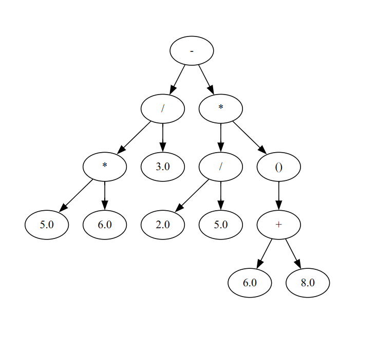

# python-lox

My implementation of Lox programming language from [Crafting interpreters](https://www.craftinginterpreters.com/contents.html) in Python.

## How to run

```sh
$ pdm install
$ source .venv/bin/activate
$ pylox
```

To generate ast files,

```sh
$ pdm run gen-ast src/python_lox/ast
```

## Screenshots

Visualization of AST for `5 * 6 / 3 - 2 / 5 * (6 + 8)`



## Additional features / modifications / challenges

1) Comma operator `,` - Evaluates to it's rightmost expression

For example,
```
var x = 5, 10, 20 * 30;
```
evaluates to 600

2) Ternary operators

For example,
```
print 5 > 3 ? "Greater" : "Lesser";
```

3) Accessing uninitialized variables is an error
```
var x;
print x * 20; // Error
```

4) Cannot redefine variables
```
var x = 20;
var x = 50; // Error (x is already defined)
x = 40;     // Assignment is supported
```

5) const variables
```
const name = "hello world";
name = "hello"; // Error: Assignment not permitted
var name = "hello"; // Error: redeclaration
```

6) typeof operator - Returns string representing the type of the given expression

```
const name = "hello";
const integer = 3;
const is_valid = true;
const value = nil;
print typeof(name); // str
print typeof(integer); // number
print typeof(is_valid); // bool
print typeof(value); // nil
```

7) `if` statement does not require parenthesis to enclose the condition. `if` and `else` statements require braced block after it, like Go and Rust. This also solves the dangling else problem.
```
if x > 3 { 
    // do something here
} else {
    // do something else
}
```

8) Similar to `if` statement, `while` statement does not require parenthesis, and requires a braced block
```
while x > 5 {
    // Statements
}
```

9) `for` loop statement does not require parenthesis
```
for var i = 0; i < 10; i = i + 1 {
    print i;
}
```

10) `break` and `continue` statement - works like regular break and continue from other languages
```
for var i = 0; i < 10; i = i + 1 {
    print i;
    if i == 5 {
        break;
    }
}
```

11) `assert` statement, prints `Assertion Error` and terminates the interpreter if it fails, useful for writing tests within the language
```
var x = 3;
assert x == 3; // Passes
assert x == 5; // Fails
assert x == 5, "x is not equal to 5"; // Prints: Assertion Error: x is not equal to 5
```

12) Implemented augmented assignment operators `+=`, `-=`, `*=`, `/=`, `%=`
```
for var i = 0; i < 10; i+= 1 { 
    print i;
}
```

13) Native functions - `clock()`, `input()`, `floor()` and `len()`, `parse_int()`, `parse_float()`, `to_string()`

Note: ParseInt and ParseFloat works similar to C# try parse, these methods return null if parsing failed, instead of throwing
exception

```
var start = clock();
print start; // 1745673189.2214336

var name = input();
print "Hello, name";

var value = floor(3.1415);
print value; // 3

print len("Program") // 7

```

14) `print` and `println` statement

